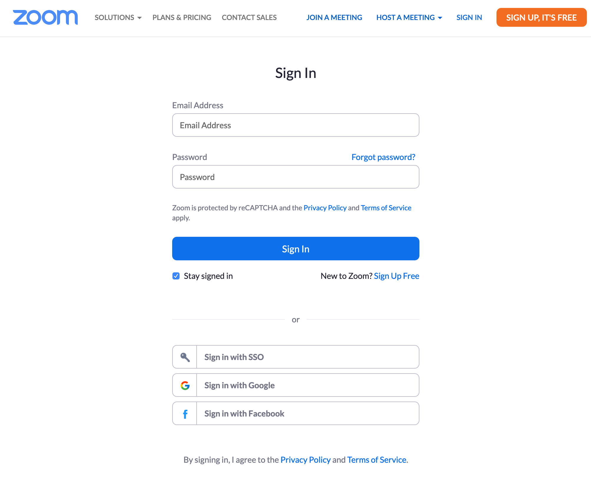
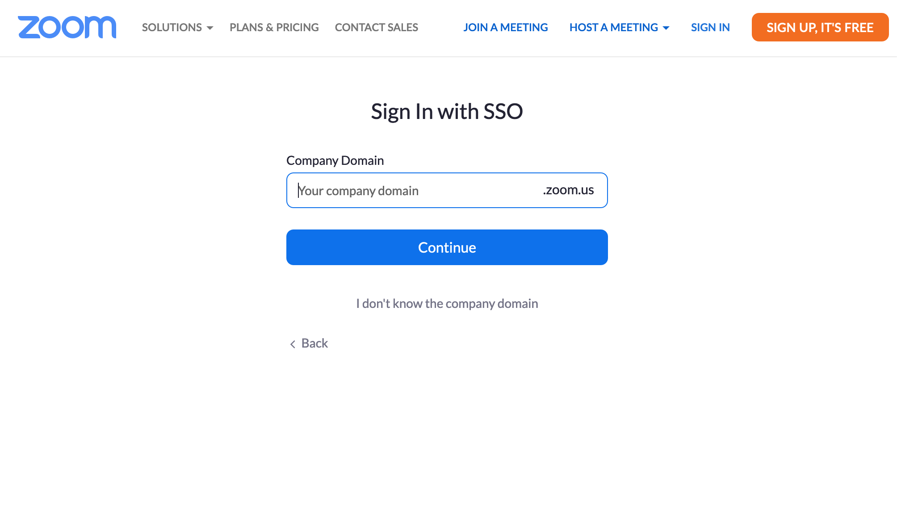

# Logging into Zoom

You can only join the sessions if you log in into Zoom
`nus-sg.zoom.us` using your NUS account.

To do so, you have to first log out of Zoom if you have already logged in using your non-NUS Zoom account.

There are two options:

## Option 1
- go to https://nus-sg.zoom.us/ directly and click "Sign In";
- Follow the given instructions by entering your NUSNET ID and password.

## Option 2
If you get to Zoom through another link, you might be presented with
the following screen.

Do not enter your NUS email address and password on this
screen.  Instead, click on "Sign in with SSO".  You will be
presented with this screen:

Enter `nus-sg` into the field "Company Domain" and click continue.

You will be prompted to enter your NUSNET ID and password.  Follow
the instruction on the screen.

## Links to Join Zoom

The Zoom session information will be/have been sent to you privately.  Check
your email for information.
